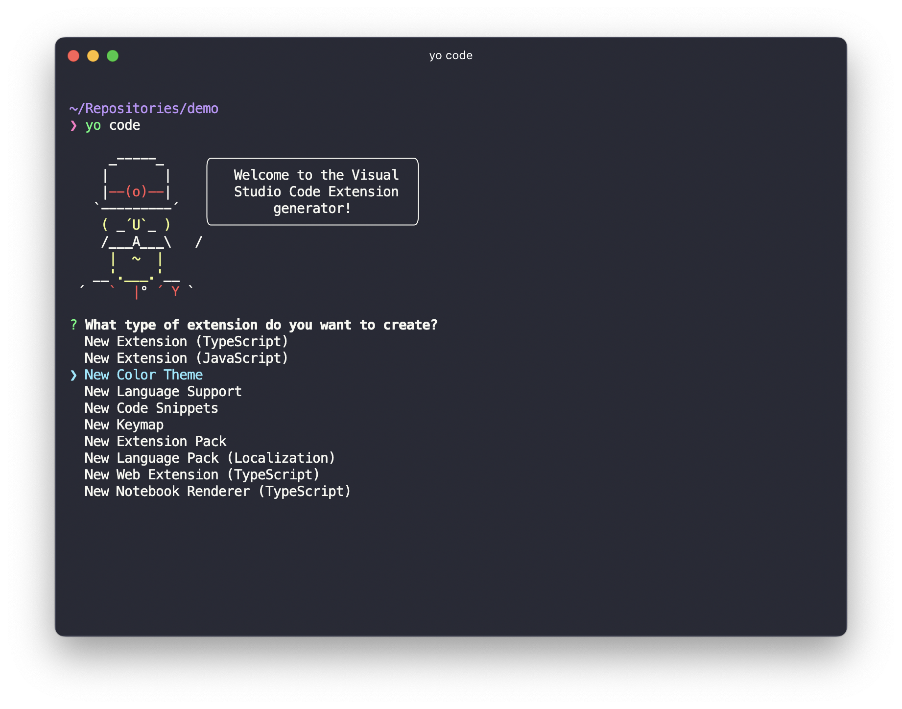
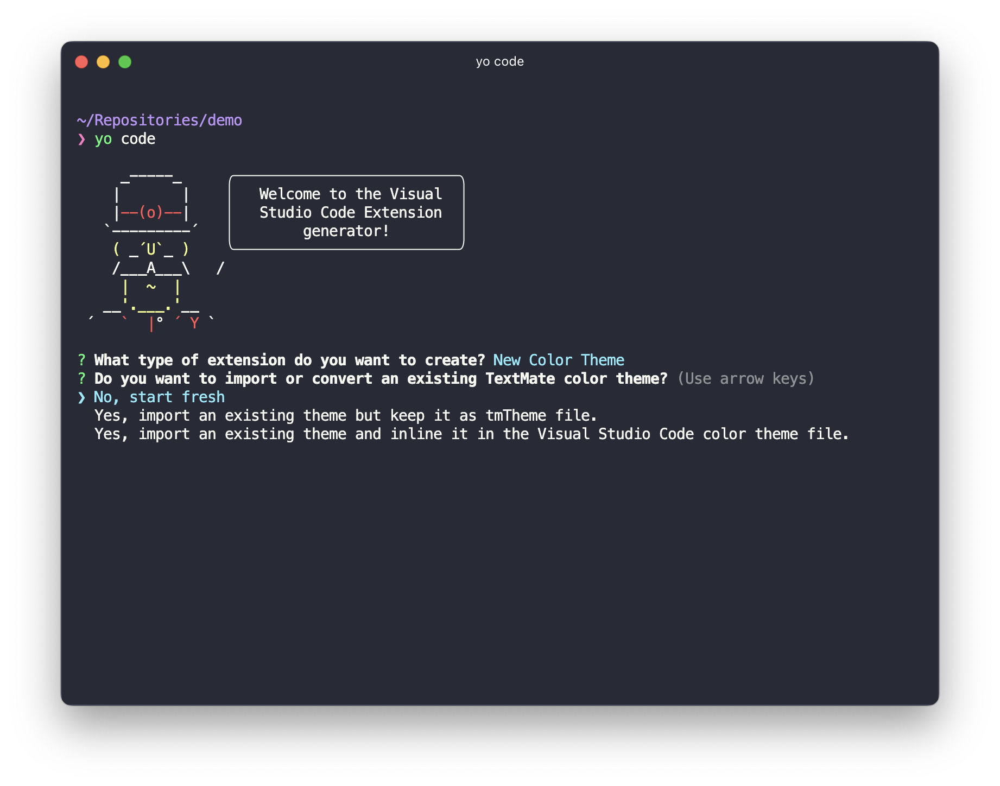
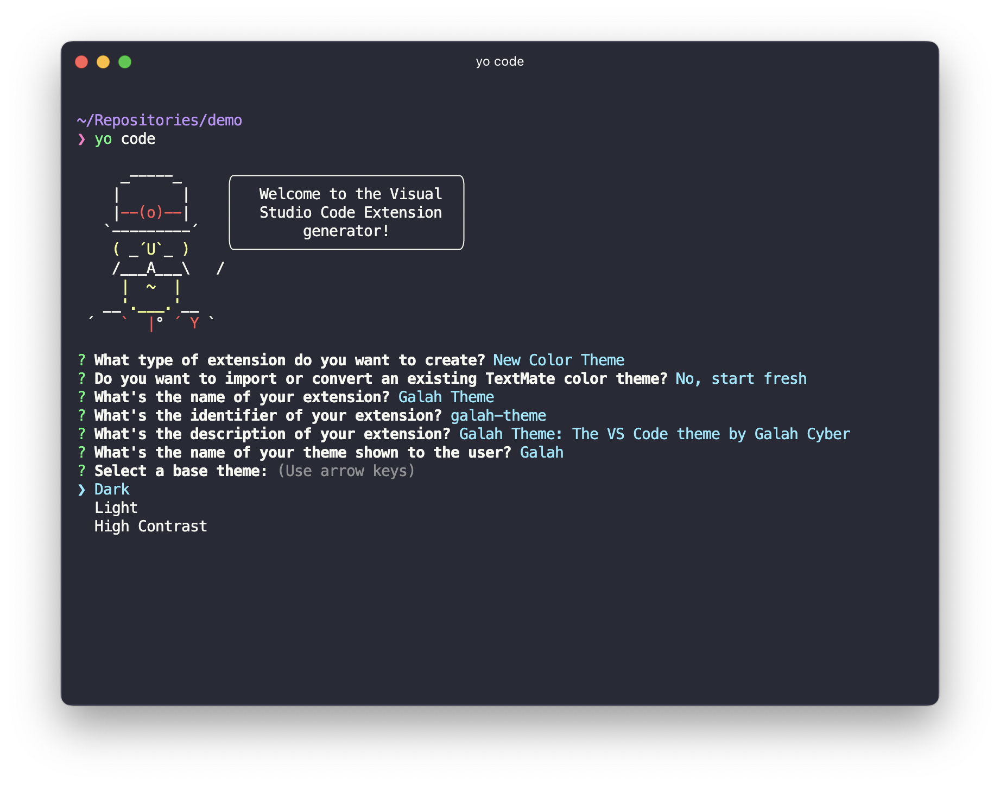
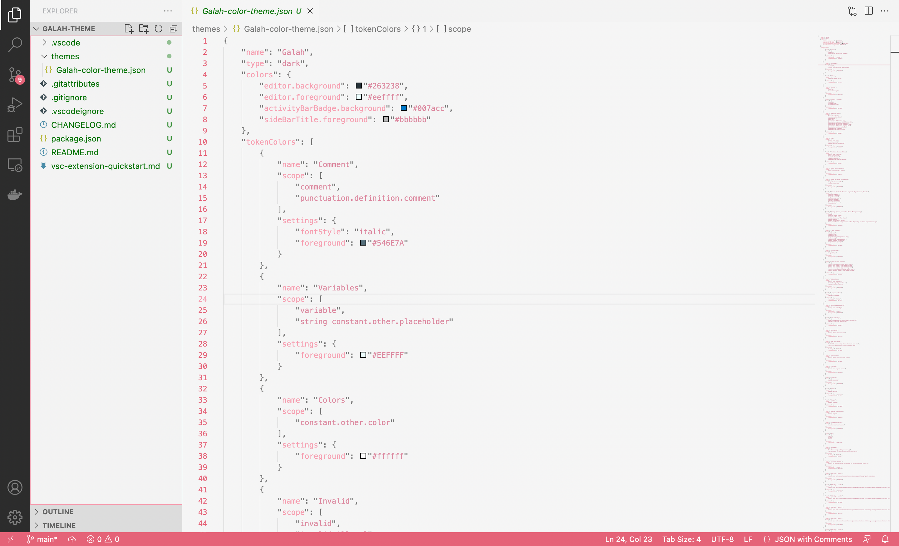

Visual Studio Code has become prolific in the tech community as the text editor of choice for many. One of the many reasons for that is the sheer amount of customisability it offers. That’s why I like it anyway.

It also like many other text editors allows you to make custom ‘themes’ for it of which VS Code users have made thousands. Whilst many are happy to use an off the shelf theme, in making one for [Galah Cyber](https://www.galahcyber.com.au), I began a very interesting process of customising and fine tuning a theme to fit ‘the look’ of Galah but also be a theme that people actually want to use.

## Getting started
To start, you need to have a few things installed:

* Node.js

* Git

With those things installed we can get going.

First we need to install yo:

```
$ npm install -g yo generator-code
```
Next simply open a terminal and navigate to the directory you want your theme. Once there run:

```
$ yo code
```
This will start the Visual Studio Code Extension generator. using your arrow keys you can make a selection, we want a new color theme:




Once you select this, choose start fresh:




Then we need to decide on a name, extension identifier (just use the default), a short description, display name, and the base theme (either the default light or dark theme).




Once you have made those decisions you will be given the option to initialise a git repository and open the project in VS Code.

Once this is done you will have a repository with a few different files.

## Making your theme
### `themes/your-color-theme.json`
This is the most important file in the project.

 



This is where you will decide on the colours you will use in your theme. Broadly this can be broken up into two main categories editor colours and workbench colours.

Editor colours are all the colours in the text editor portion of VS Code. These are the colours you change if you want to alter your syntax highlighting. It is based off of an older text editor known as Textmate, which used scopes to define which parts of a language’s syntax would be coloured.

Workbench colours are all the other colours. It is the colour of buttons, menu selections and so on. Microsoft have a really helpful article which covers off on all of the parts of VS Code you can change with a theme extension.

### Deciding on colours
This part is largely up to you and is the most time consuming part of the theme development process. Here are some tips I recommend you follow:

1. Make it easy to read
First and foremost, your text editor needs to be easy to read. There is no point developing a theme that is ultimately unusable because the colours are too similar and don’t provide enough contrast.

2. Try reading a little colour theory
This will help you pick colours that complement each other and help you make a beautiful theme. An article that I read when developing my theme emphasised this point and you can find it [here](https://css-tricks.com/creating-a-vs-code-theme/).

3. If in doubt, test it out
Test! If you are unsure about your colours you can always test them out. This will make it easier for you to identify whether your colours work together, and look the way you imagine them to.

But how do you test?

## Testing your theme
Testing your theme is a relatively simple process.

Open the project in VS Code and press `F5` if on windows or `fn + F5` if on MacOS. This will launch a new window with your theme.

In this mode you can also use a tool to help you identify what textmate scope is responsible for a certain colour in your editor.

To do this press `ctrl + shift + p` on windows or `cmd + shift + p` on MacOS and type in `Developer: Inspect Editor Tokens and Scopes`. You can now select tokens in your editor and see their scopes.

I suggest you make yourself a folder of code snippets from a wide range of different languages so that you can see how your theming looks in a range of scenarios. It is a painful thing to discover after putting in the hours to select a theme that works for one language, for it to not work for another entirely.

## Installing your theme
Installing your theme locally is a simple process. Simply copy your repository from wherever you are developing to `~/.vscode/extensions/your-theme` on Linux/MacOS or `%USERPROFILE%\.vscode\extensions\galah-theme` on Windows. Once you have done that, you’re done and ready to use your theme.

If you want to publish your theme to the VS Code Marketplace, you can learn more about that [here](https://code.visualstudio.com/api/extension-guides/color-theme#create-a-new-color-theme).
